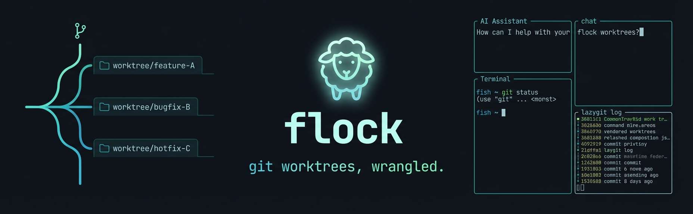

# flock



A [fisher](https://github.com/jorgebucaran/fisher) plugin for git worktree management — create, switch, and clean up worktrees with an auto-configured multi-pane workspace (Zellij or cmux).

Each `flock new` opens a new tab with three panes: your AI coding assistant (Claude or Codex), a terminal, and lazygit — all scoped to the worktree directory.

## Install

```fish
fisher install roderik/flock
```

## Dependencies

**Required:** `git`, `gh`, `fzf`, [worktrunk](https://github.com/nicholasgasior/worktrunk) (`wt` binary)

**Optional:**
- `zellij` or `cmux` — multi-pane workspace support (degrades to bare terminal without)
- `lazygit` — git pane in workspace
- `linear` CLI — Linear ticket integration
- `claude` or `codex` — AI assistant launched in workspace pane

## Usage

```fish
flock new [branch|PR|ticket]   # Create or open a worktree
flock delete                   # Delete a worktree via fzf picker
flock tab-setup                # Set up a 3-pane workspace in the current dir
```

### flock new

Without arguments, opens an fzf picker showing existing worktrees and open GitHub PRs.

```fish
flock new                      # fzf picker: worktrees + open PRs
flock new my-feature           # create worktree on branch my-feature
flock new 42                   # check out PR #42
flock new https://github.com/org/repo/pull/42
flock new PAP-123              # create worktree from Linear ticket
flock new https://linear.app/org/issue/PAP-123/my-ticket
flock new -x my-feature        # same, but launch codex instead of claude
```

### flock delete

Opens an fzf picker listing all worktrees (current branch preselected). Removes the worktree, its local branch, and closes the Zellij/cmux tab if running inside one.

```fish
flock delete
```

### flock tab-setup

Opens a new workspace tab (Zellij or cmux) scoped to the current directory, with three panes: AI assistant (main), terminal, and lazygit.

```fish
flock tab-setup
flock ts     # alias
```

## Abbreviations

| Subcommand        | `f*` | `wt*` |
|-------------------|------|-------|
| `flock new`       | `fn` | `wtn` |
| `flock delete`    | `fd` | `wtd` |
| `flock tab-setup` | `fs` | `wts` |

`wt*` abbreviations are retained for backward compatibility.

## Configuration

| Variable             | Default    | Purpose                                    |
|----------------------|------------|--------------------------------------------|
| `$FLOCK_REMOTE_HOST` | `daystrom` | Remote host used by `zjr` (remote zellij) |

Set these in your `config.fish` before the values are first used:

```fish
set -gx FLOCK_REMOTE_HOST myserver
```

## Zellij layout

A `flock.kdl` layout is included and symlinked to `~/.config/zellij/layouts/flock.kdl` automatically on shell start.

The layout opens a single tab with:
- **Left 70%** — Main pane (AI assistant, focused) + Terminal pane below
- **Right 30%** — Git pane running `lazygit`

To use it manually:

```fish
zellij --layout flock
```

## License

MIT
